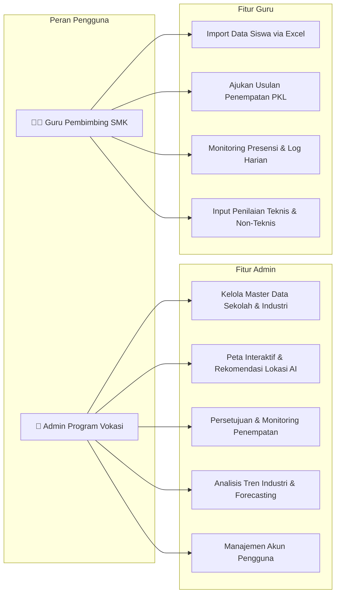

# Buku Panduan Pengguna VokasiFlow AI (User Manual)

> **Versi:** 1.0.0  
> **Target Pengguna:** Pengelola Program Vokasi (Admin), Guru Pembimbing SMK, Koordinator PKL/Magang  
> **Tampilan Visual Interaktif:** Buka [user-manual.html](file:///c:/Users/SANTO/Vibecoding/vokasiflow-ai/docs/user-manual.html) untuk panduan visual dengan simulasi interaktif & video 1 menit.

---

## 1. Pengenalan VokasiFlow AI

**VokasiFlow AI** adalah platform terpadu untuk mempermudah pengelolaan program Praktik Kerja Lapangan (PKL/Magang) bagi Sekolah Menengah Kejuruan (SMK) dan institusi vokasi. 

Dengan VokasiFlow AI, Anda dapat:
- 🗺️ **Memetakan Industri & Sekolah** secara spasial pada peta interaktif Google Maps.
- ⚡ **Mengimpor Data Massal** (Siswa, Sekolah, Industri) hanya dengan mengunggah berkas Excel.
- 🤖 **Mendapatkan Rekomendasi AI** untuk penempatan magang siswa sesuai jurusan, keahlian, dan lokasi terdekat.
- 📈 **Memantau Aktivitas Harian Siswa** secara berkala (presensi, jurnal magang, dan evaluasi nilai).
- 🔮 **Memprediksi Tren Kebutuhan Industri** (*Forecasting*) untuk perencanaan kurikulum masa depan.

---

## 2. Alur Penggunaan Berdasarkan Peran (Role)

---

## 3. Panduan Langkah demi Langkah (How-To Guides)

### A. Panduan Masuk Sistem (Login)
1. Buka tautan web **VokasiFlow AI** pada peramban Anda.
2. Klik tombol **"Masuk / Login"** di pojok kanan atas.
3. Masukkan **Alamat Email** dan **Kata Sandi** yang telah terdaftar.
4. *Tip:* Anda juga dapat menggunakan tombol **Demo Access** untuk mencoba akses cepat sebagai *Admin* atau *Guru*.

---

### B. Cara Mengimpor Data Siswa via Excel (Panduan Guru/Admin)
1. Buka menu **"Siswa"** di sidebar.
2. Klik tombol **"Import Data Excel"** berwarna hijau di kanan atas tabel.
3. Klik tautan **"Unduh Template Excel"** jika Anda belum memiliki format yang sesuai.
4. Isi data siswa (NISN, Nama Lengkap, Jurusan, Kelas, Nilai Rata-rata/IPK, Keterampilan).
5. Seret (*drag & drop*) berkas Excel Anda ke area unggah.
6. Periksa pratinjau data pada tabel validasi. Baris yang memiliki kesalahan format akan ditandai dengan warna merah.
7. Klik tombol **"Simpan & Simpan Semua Data"** untuk memproses data ke dalam sistem.

---

### C. Cara Menggunakan Peta Interaktif & Rekomendasi AI
1. Buka menu **"Peta & Rekomendasi"** atau **"Perusahaan Mitra"**.
2. Pada peta Google Maps:
   - 🏫 **Pin Biru:** Lokasi Sekolah / SMK.
   - 🏢 **Pin Oranye/Hijau:** Lokasi Mitra Industri (DUDI) dan Cabang PKL.
3. Klik salah satu pin industri untuk melihat kuota penerimaan magang yang masih tersedia.
4. Buka tab **"Rekomendasi AI"** untuk melihat daftar siswa yang paling cocok dipasangkan ke industri tersebut berdasarkan kesesuaian kompetensi dan jarak tempuh terdekat.

---

### D. Cara Melakukan Penempatan & Persetujuan Magang
1. Buka menu **"Penempatan Magang"**.
2. Klik **"Tambah Penempatan Baru"**.
3. Pilih **Nama Siswa**, **Perusahaan Mitra Tujuan**, **Guru Pembimbing**, serta **Periode Mulai & Selesai**.
4. Klik **"Ajukan Penempatan"**.
5. Admin program vokasi dapat meninjau dan mengubah status penempatan menjadi **"Disetujui"**, **"Berjalan"**, atau **"Selesai"**.

---

### E. Cara Guru Memantau Aktivitas Harian & Penilaian Siswa
1. Masuk sebagai **Guru**, lalu buka menu **"Monitoring Aktivitas"**.
2. Pilih nama siswa yang sedang dibimbing.
3. Tinjau log aktivitas harian, catatan pekerjaan, dan status presensi yang diunggah siswa.
4. Berikan verifikasi dan catatan evaluasi pembimbing.
5. Saat periode magang berakhir, buka menu **"Evaluasi & Nilai"** untuk menginput:
   - Nilai Teknis (*Hard Skills*)
   - Nilai Sikap & Kedisiplinan (*Soft Skills*)
   - Catatan Akhir Kelulusan PKL.

---

### F. Cara Admin Menggunakan AI Forecasting & Tren Industri
1. Masuk sebagai **Admin**, lalu buka menu **"Forecasting & Analytics"**.
2. Pilih sektor industri (misal: *Teknologi Informasi, Otomotif, Teknik Mesin, Logistik*).
3. Sistem AI akan menampilkan:
   - Proyeksi kebutuhan tenaga kerja magang untuk 6–12 bulan ke depan.
   - Keterampilan spesifik yang paling dicari oleh mitra industri.
   - Rekomendasi penyesuaian kurikulum atau alokasi siswa magang.

---

## 4. Pusat Bantuan & FAQ (Pertanyaan yang Sering Diajukan)

- **Q: Apakah saya bisa mengimpor data jika ada format yang kosong?**  
  *A:* Kolom wajib seperti NISN, Nama Siswa, dan Jurusan harus terisi. Kolom opsional (seperti nomor telepon orang tua) boleh dikosongkan.
- **Q: Bagaimana jika lokasi sekolah atau industri di peta tidak akurat?**  
  *A:* Buka data sekolah/industri terkait, klik **"Edit"**, lalu masukkan koordinat Latitude & Longitude yang tepat atau cari alamatnya melalui kotak pencarian alamat.
- **Q: Apakah data siswa antar-sekolah aman?**  
  *A:* Sangat aman. Sistem menerapkan isolasi data ketat (*Row Level Security*) sehingga guru dari satu sekolah hanya dapat melihat data siswa dari sekolahnya sendiri.
